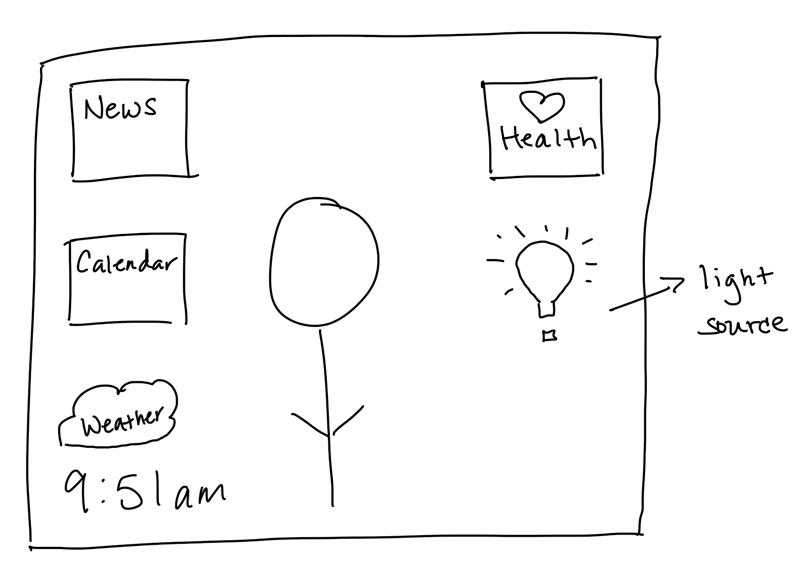

# Report 
---

### Links
[Presentation page](https://msilva2248.github.io/p2.Matthew.Silva/)

[GitHub repository](https://github.com/msilva2248/p2.Matthew.Silva)

[Demo](https://media.giphy.com/media/NXVF5ZL5lLwcvSuFdI/giphy.gif)

### Getting C:
Provide the Sketch

General information:
    personalized calendar: triggers a pop up that displays calendar events to do
    news feed: triggers a pop up that dispays current news
    clock: triggers a pop up that displays a running clock
    weather: triggers a pop up that displays current weather, and a 7-day weekly forecast
    flashlight: triggers a pop up that allows you to change the color and act as a light source

Include the health-related information in your sketch: sleep, weight, exercises.
    Triggers a pop up that displays information from a JSON file
        sleep: displays sleep information
        weight: displays current weight
        exercises: displays type of exercise and length of workout

### Getting B:
Implement your Sketch in Processing or p5.js.
Implement the general information: calender, news feed, current clock, weather (from JSON files)
    implemented each of these and read the data from a JSON file for each
Implement the health-related information in your sketch (select one of these): sleep, weight, exercises, and mirror time (from a csv or json file).
    implemented sleep, weight, and exercises (from JSON file)
    these displays are visible to the user at the same time as your reflection

### Getting A

- Implement one of the advanced features
    implemented a flashlight to allow the user to choose the light source
    github report page and 2-minute presentation video will be attached
